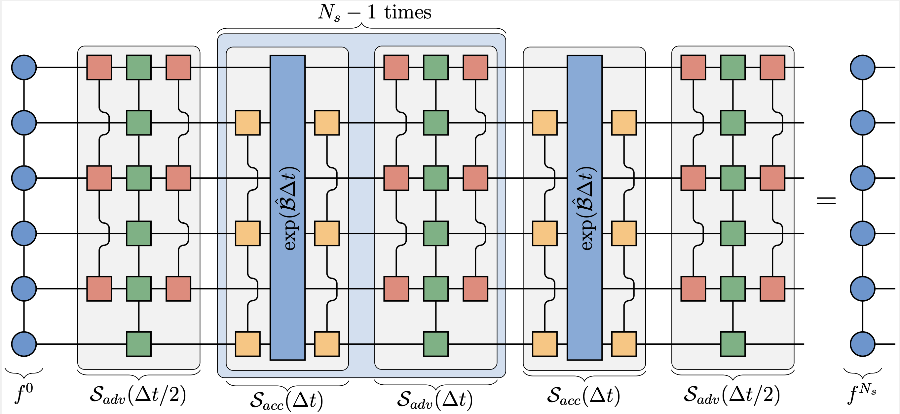

# VlasovTT.jl

VlasovTT.jl is a Julia project for simulating 1D1V Vlasov-Poisson dynamics with tensor-train (TT/MPS) representations. The code combines quantics grids, tensor cross interpolation (TCI), and Strang splitting to evolve kinetic plasma problems such as linear Landau damping and the two-stream instability.

## Introduction

The project focuses on efficient kinetic simulations in high-dimensional tensor formats. Core components include:

- TT-based representation of phase-space distribution functions.
- MPO/MPS operators for free streaming, and Poisson solvers.
- Time stepping via second order Strang splitting.
- Tensor cross interpolation (TCI) used to implement acceleration induced by the self-consistent electric field.
- Diagnostics and output routines for conservation, runtime, and field energy tracking.

## Repository Structure

- `src/`: package source code.
- `src/operators/`: operator construction (free streaming, acceleration, Poisson).
- `src/steppers/`: time-stepping kernels and `SimulationParams`.
- `examples/`: executable simulation scripts:
  - `examples/landau_damping.jl`
  - `examples/two_stream.jl`
- `tests/`: validation scripts (currently `tests/test_electric_field.jl`).
- `plots/`: plotting utilities and figure-generation scripts.
- `results/`: outputs produced by example runs.
- `final_results/`: archived/processed experiment outputs.
- `docs/figures/`: documentation images (including the algorithm schematic).

## Setup

From the repository root:

```bash
julia --project -e 'using Pkg; Pkg.instantiate()'
```

This resolves dependencies from `Project.toml`/`Manifest.toml`.

## Running the Example Files

Run examples directly from the repository root:

```bash
julia --project examples/landau_damping.jl
julia --project examples/two_stream.jl
```

Or, from inside the `examples/` directory:

```bash
cd examples
julia --project=.. landau_damping.jl
julia --project=.. two_stream.jl
```

Notes:

- Both scripts currently execute `run_simulation_sweep(...)` at the bottom of the file.
- The default `use_gpu` setting in those sweeps is `true`. If you want CPU-only runs, set `use_gpu = false` in the final `run_simulation_sweep(...)` call of each script.
- Output is written under `results/<simulation_name>/...` and includes:
  - `simulation_params.txt`
  - `data.csv`
  - `runtime.csv`
  - `bond_dims.csv`
  - `figures/` (phase-space and electric-field plots)
  - `mps/` (saved state snapshots)

## Reference

The code, algorithms and results in this code repository are presented in the paper *Tensor-Network Compression for Fully Spectral Vlasov–Poisson Simulation*. An arXiv preprint is available at: TODO.


## License

This project is licensed under the MIT License. See `LICENSE`.
